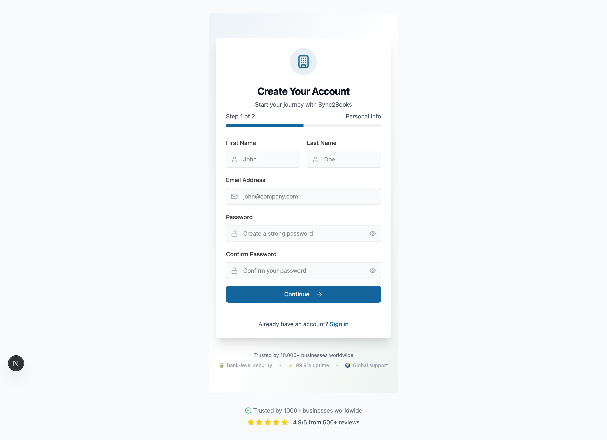
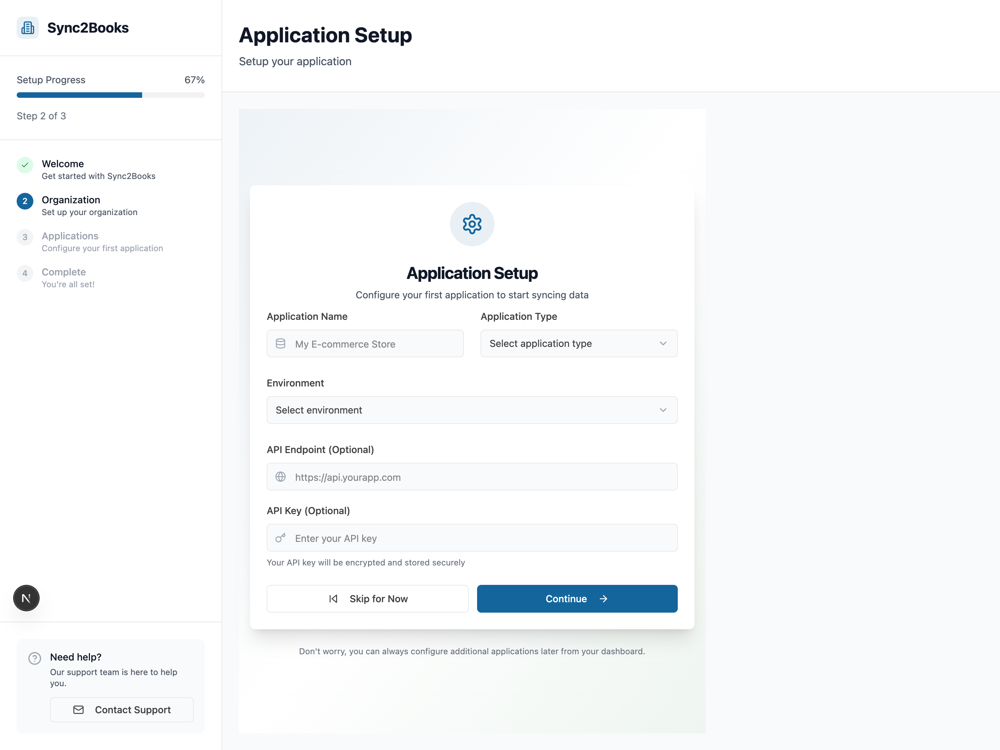
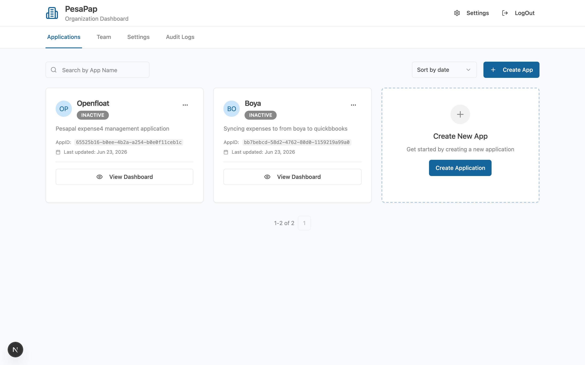
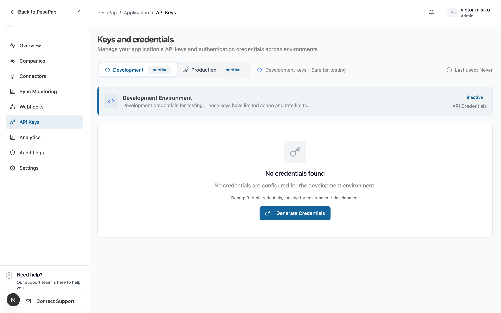

# Get Started with eTIMS

This guide takes you from zero to a **signed KRA receipt** for your first sale.

The journey has two parts that mirror how the platform works:

- **Part 1 — Set up in the dashboard** (no code): create your app, get your API key, and **connect your company to eTIMS**. We handle the KRA/OSCU onboarding hoops for you here.
- **Part 2 — Operate via the API** (your code): register items, manage stock, and create sales.

> **The split in one line:** the **dashboard** connects a company to eTIMS once; your **code** does the day-to-day invoicing.

---

## Part 1 — Set up in the dashboard

Everything in the API is scoped to an **application**, and applications belong to an **organization**:

```
Organization  ─┬─  Application  ─┬─  Credential (Development:  sk_development_…)
   (your        │   (your client │
    company)    │    / product)  └─  Credential (Production:   sk_production_…)
```

### Step 1.1 — Create your account

Go to the [Sync2Books Dashboard](https://app.sync2books.com) and sign up. The form is a short two-step wizard: your personal details, then your organization (company name, industry, team size).



Submitting creates your **user**, your **organization**, and logs you in.

### Step 1.2 — Create an application

Onboarding walks you through creating your first **application** — your product/integration, which owns the API keys you'll use.



You can manage applications anytime from **Dashboard → Organization**.



### Step 1.3 — Copy your API key

Open your application → **API Keys**. Toggle between **Development** and **Production**, then copy the **API Key** (`x-api-key`). Use **Development** while building.



Your key looks like:

```
sk_development_a1b2c3d4e5f6...      # safe for testing
sk_production_z9y8x7w6v5u4...       # live credentials
```

> **Authentication.** Every API call later sends this key in the `X-API-Key` header. An HMAC signature (`X-Signature` + `X-Timestamp`) is **optional but recommended** for production — see [API Reference → Authentication](./etims-api-reference.md#authentication).

### Step 1.4 — Add your company and connect it to eTIMS

This is the step that saves your customers from the KRA gauntlet. In the dashboard, add the business as a **company**, then open its **eTIMS** card and provision the connection: enter the KRA PIN, OSCU device serial, and branch details, and click **Provision**. Sync2Books runs the OSCU device initialization and activates the connection.


When it succeeds, the company shows as **Connected** and you have a **branch key** (e.g. `HQ`) that you'll use in API calls.

> Where do the KRA PIN, device serial, and branch ID come from? From the business's KRA OSCU onboarding — see **[the third-party integrator guide](./ETIMS_OSCU_INTEGRATION_AS_THIRD_PARTY.md)**. Sandbox values are fine while developing.
>
> Prefer to automate onboarding for many companies? There's an optional **provisioning API** too — see [Provisioning → Advanced](./etims-provisioning.md#advanced-provision-via-api).

You now have everything you need to call the API: an **API key** and a **connected company** (with its `companyId` and a `branchId`).

---

## Part 2 — Operate via the API

From here it's your code. Replace `{apiKey}`, `{companyId}` (from the dashboard), and `{branchId}` (e.g. `HQ`).

> **Want to try these instantly?** Import the [eTIMS Postman Collection](./etims-postman.md) — every request below is in it, with variables for your key and IDs.

> **The golden order matters.** eTIMS entities have prerequisites. Follow this sequence — skipping a step produces clear, but avoidable, errors:
>
> `register item → sync item → add stock → create sale → (credit note)`
>
> (The **add stock** step is for **goods** only — **services** are non-stock, so skip it. See [Goods vs Services](./etims-catalog.md#goods-vs-services-stock-vs-non-stock).)

### Step 2.1 — Register a catalog item

Register a product you want to sell. `externalId` is your own stable identifier (your SKU or accounting-system id).

```bash
curl -X POST "https://api.sync2books.com/companies/{companyId}/integrations/etims/catalog/items" \
  -H "X-API-Key: {apiKey}" \
  -H "Content-Type: application/json" \
  -d '{
    "externalId": "sku-1001",
    "name": "Maize Flour 2kg",
    "itemType": "GOODS",
    "taxCategory": "VAT_STANDARD",
    "classificationCode": "14111400",
    "unitCode": "U",
    "packagingUnitCode": "NT"
  }'
```

```json
{ "syncBatchId": "9f0c…" }
```

> **`classificationCode` is effectively required** — without a valid KRA item classification code the register is rejected. See [Catalog](./etims-catalog.md#classification-codes).

You'll need the item's **`id`** next. Read it back from the catalog list (distinct from your `externalId`):

```bash
curl -X GET "https://api.sync2books.com/companies/{companyId}/integrations/etims/catalog/items" \
  -H "X-API-Key: {apiKey}"
```

### Step 2.2 — Sync the item to eTIMS

Registering stores the item; **syncing** registers it with KRA and assigns an eTIMS item code. An item **cannot be sold until it's synced**.

```bash
curl -X POST "https://api.sync2books.com/companies/{companyId}/integrations/etims/catalog/items/sync" \
  -H "X-API-Key: {apiKey}" \
  -H "Content-Type: application/json" \
  -d '{ "branchId": "{branchId}", "onlyPending": true }'
```

```json
{ "syncBatchId": "a1b2…" }
```

After this completes, the item's `registrationStatus` becomes `REGISTERED`.

### Step 2.3 — Add stock (goods only)

Our example item is a **good** (`itemType: GOODS`), which is stock-tracked — a sale deducts inventory, so seed some stock first. Note this is a `PUT`.

> Selling a **service** (`itemType: SERVICE`)? Services are **non-stock** — skip this step and go straight to the sale. See [Goods vs Services](./etims-catalog.md#goods-vs-services-stock-vs-non-stock).

```bash
curl -X PUT "https://api.sync2books.com/companies/{companyId}/integrations/etims/stock/adjust" \
  -H "X-API-Key: {apiKey}" \
  -H "Content-Type: application/json" \
  -d '{ "itemId": "{itemId}", "branchId": "{branchId}", "quantity": 100, "action": "ADD" }'
```

```json
{ "syncBatchId": "c3d4…" }
```

### Step 2.4 — Create a sale

Now invoice the item. The line item `id` is the item **`id`** from Step 2.1 (not your `externalId`).

```bash
curl -X POST "https://api.sync2books.com/companies/{companyId}/integrations/etims/sales" \
  -H "X-API-Key: {apiKey}" \
  -H "Content-Type: application/json" \
  -d '{
    "branchId": "{branchId}",
    "saleDate": "2026-06-20",
    "traderInvoiceNumber": "INV-0001",
    "receiptTypeCode": "S",
    "paymentTypeCode": "01",
    "invoiceStatusCode": "02",
    "items": [
      {
        "id": "{itemId}",
        "quantity": 2,
        "unitPrice": 100,
        "taxCategory": "VAT_STANDARD",
        "taxAmount": 32,
        "itemDescription": "Maize Flour 2kg"
      }
    ]
  }'
```

```json
{ "syncBatchId": "e5f6…" }
```

This is **asynchronous**. Once KRA accepts the sale, it returns a signed **ETR receipt number**. Read it back:

```bash
curl -X GET "https://api.sync2books.com/companies/{companyId}/integrations/etims/sales" \
  -H "X-API-Key: {apiKey}"
```

The sale is then marked **accepted** and carries a KRA receipt number (`ETR-…`). See [Tracking Results](./etims-tracking-results.md) for how to know when it's done.

### Step 2.5 — (Optional) Issue a credit note

To reverse an accepted sale, raise an express credit note referencing the sale's `id` (`saleId`):

```bash
curl -X POST "https://api.sync2books.com/companies/{companyId}/integrations/etims/sales/credit-notes/express" \
  -H "X-API-Key: {apiKey}" \
  -H "Content-Type: application/json" \
  -d '{
    "branchId": "{branchId}",
    "saleId": "{saleDocumentId}",
    "traderInvoiceNumber": "CN-0001",
    "returnDate": "2026-06-20"
  }'
```

---

## Recap

In the **dashboard** you:

1. Created an account, organization, and application, and copied your **API key**
2. Added a **company** and **connected it to eTIMS** (we handled OSCU onboarding)

Then via the **API** you:

3. **Registered** and **synced** a catalog item
4. **Added stock**
5. Created a **sale** and received an **ETR receipt**
6. (Optionally) issued a **credit note**

That's the full loop.

## Read next

- [Postman Collection](./etims-postman.md) — run every request in seconds
- [Provisioning](./etims-provisioning.md) — the dashboard flow (and optional API)
- [Catalog](./etims-catalog.md) — classification codes, the REGISTERED lifecycle
- [Sales & Credit Notes](./etims-sales.md) — document states, prerequisites, receipts
- [Stock](./etims-stock.md) — adjust and transfer
- [Tracking Results](./etims-tracking-results.md) — the async model
- [API Reference](./etims-api-reference.md) — every endpoint and field
