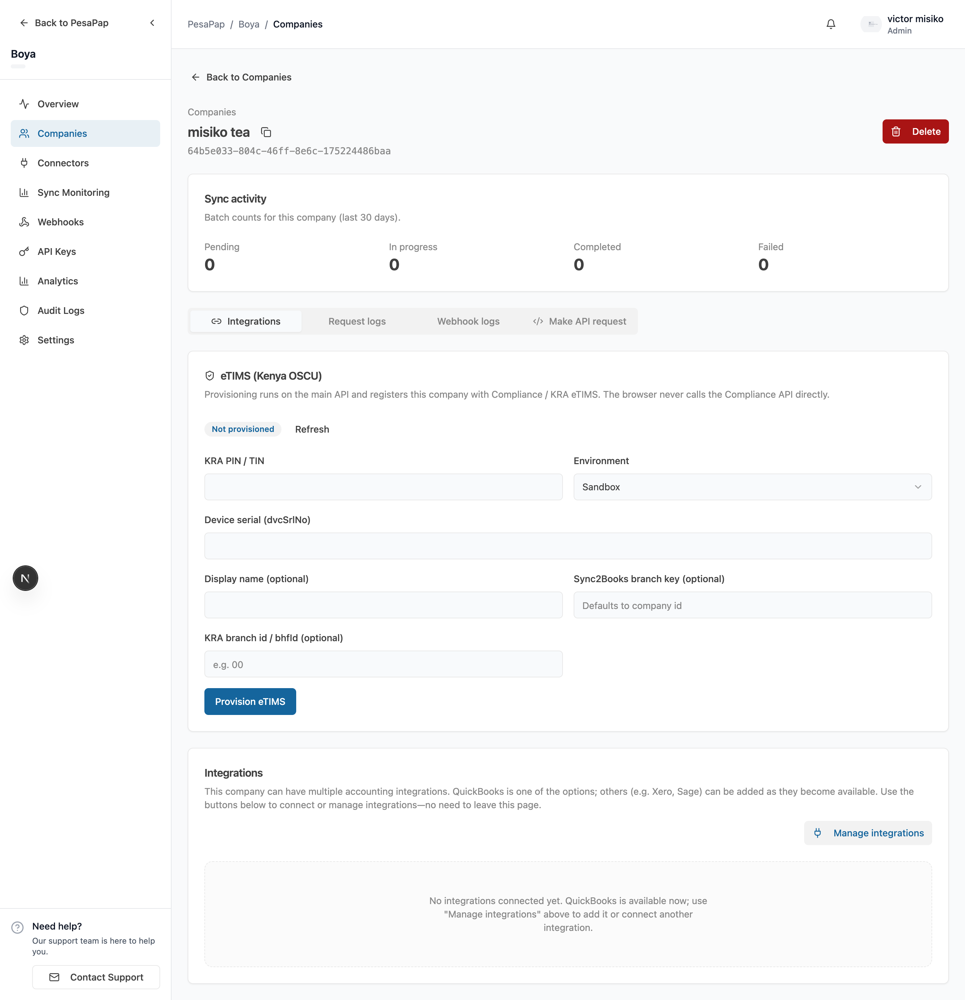

# Provisioning eTIMS

Provisioning connects a company to KRA eTIMS. It's the **one-time setup** that must happen before that company can register items or create sales.

**For most integrations, provisioning is done in the dashboard — not in code.** That's deliberate: it keeps the KRA/OSCU onboarding hoops out of your application. You (or your customer) enter the KRA details once in the dashboard, and Sync2Books does the rest.

When you connect a company, Sync2Books:

1. Maps your **branch key** to the KRA branch
2. Initializes the **eTIMS device** with KRA
3. Activates the **connection**

This is **synchronous** — when it completes, the company is connected and ready.

## Provision in the dashboard (recommended)

1. Open the company in the dashboard.
2. On the **eTIMS** card, enter the KRA details and click **Provision**.
3. Wait for the status to show **Connected**.



That's it — no API call required. The company now has a **branch key** (e.g. `HQ`) you'll use in API calls.

## Where the credentials come from

The values you enter are issued by KRA during that business's OSCU onboarding, not by Sync2Books:

| Field | Meaning | Source |
|-------|---------|--------|
| KRA PIN | The business's KRA PIN | The customer's KRA registration |
| Device serial (`dvcSrlNo`) | OSCU device serial number | KRA OSCU service request / device |
| KRA branch ID (`kraBhfId`) | KRA branch office ID (often `00` for head office) | KRA after OSCU approval |
| Environment | `SANDBOX` while testing, `PRODUCTION` when live | You choose |
| Branch key (`sync2booksBranchKey`) | **Your** branch identifier (e.g. `HQ`) used in all later API calls | You choose |

For the full KRA-side process (certification, Integration Token, device initialization, sandbox vs production), see **[eTIMS as a Third-Party Integrator (OSCU)](./ETIMS_OSCU_INTEGRATION_AS_THIRD_PARTY.md)**.

## branchId vs kraBhfId — don't mix them up

Two different identifiers:

- **Branch key** (`sync2booksBranchKey` / `branchId`, e.g. `HQ`) — the **logical branch key you choose**. This is what you pass as `branchId` in catalog sync, sales, and stock API calls.
- **`kraBhfId`** (e.g. `00`) — KRA's internal branch office ID. Provided once at provision time; you do **not** use it in operational API calls.

## Check provisioning status

You can see a company's eTIMS status in the dashboard, or fetch it programmatically (JWT-authenticated, application-scoped):

```
GET /applications/{applicationId}/companies/{companyId}/integrations/etims/status
```

```json
{
  "status": "connected",
  "connectionId": "7baba7cc-…",
  "details": { "...": "opaque connection response" }
}
```

`status` is `none` when the company has never been provisioned, otherwise the connection status (e.g. `connected`, `pending`).

## Advanced: provision via API

If you're onboarding **many companies programmatically** (e.g. a bulk migration, or your own onboarding wizard), there's an API-key endpoint that does exactly what the dashboard does. Most integrations won't need this.

```bash
curl -X POST "https://api.sync2books.com/companies/{companyId}/integrations/etims/provision" \
  -H "X-API-Key: {apiKey}" \
  -H "Content-Type: application/json" \
  -d '{
    "kraPin": "P000000045T",
    "environment": "SANDBOX",
    "dvcSrlNo": "DVC-ABC123",
    "displayName": "Mama Mboga Stores",
    "sync2booksBranchKey": "HQ",
    "kraBhfId": "00"
  }'
```

### Request body

| Field | Type | Required | Notes |
|-------|------|----------|-------|
| `kraPin` | string | ✅ | min length 3 |
| `environment` | `SANDBOX` \| `PRODUCTION` | ✅ | |
| `dvcSrlNo` | string | ✅ | OSCU device serial |
| `displayName` | string | — | merchant display name |
| `sync2booksBranchKey` | string | — | your branch key; defaults to head office. **Use this same value** as `branchId` everywhere else |
| `kraBhfId` | string | — | KRA branch office ID, e.g. `00` |

### Response

```json
{
  "connectionId": "7baba7cc-4ae0-48fd-a617-98d55a6fc008",
  "defaultBranchId": "HQ",
  "environment": "SANDBOX",
  "initialized": true
}
```

| Field | Meaning |
|-------|---------|
| `connectionId` | The connection id |
| `defaultBranchId` | The branch you'll pass as `branchId` in later calls |
| `initialized` | Whether the eTIMS device was initialized |

## Idempotency & re-provisioning

- Provisioning an **already-connected** company returns **`409 Conflict`** — it does not silently re-initialize.
- Treat provision as a one-time setup per company/branch. To change KRA details, follow your re-onboarding process rather than blindly re-provisioning.

## Common errors

| Symptom | Cause | Fix |
|---------|-------|-----|
| `409 Conflict` | Company already provisioned | Skip provisioning; it's already connected |
| `400` validation error | Missing KRA PIN / environment / device serial | Provide all required fields |
| Downstream init failure | Wrong KRA PIN / device serial / sandbox not approved | Verify the OSCU onboarding for that business (see the integrator guide) |

## Read next

- [Catalog](./etims-catalog.md) — register and sync the items you'll sell (API)
- [API Reference → Provision](./etims-api-reference.md#provision) — full field reference
